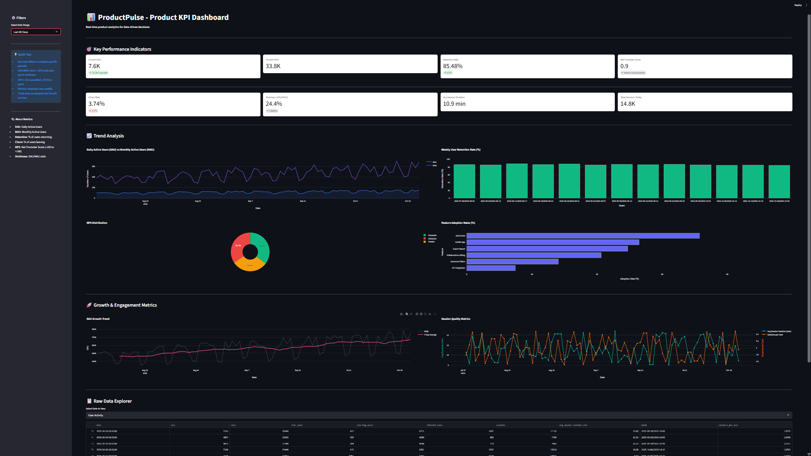
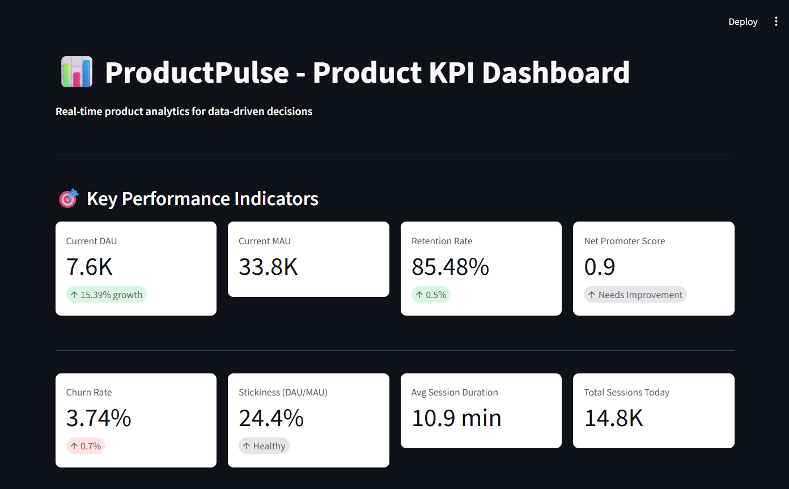
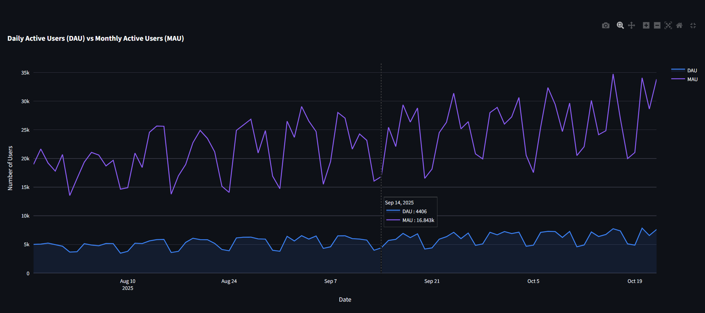
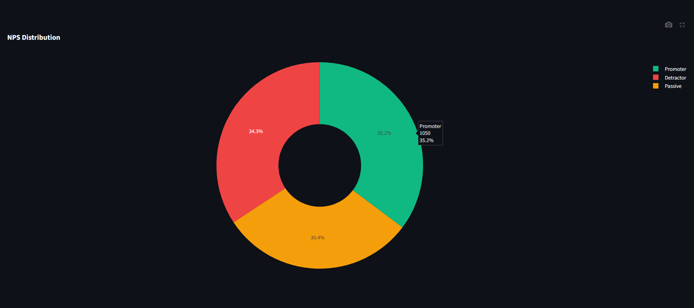
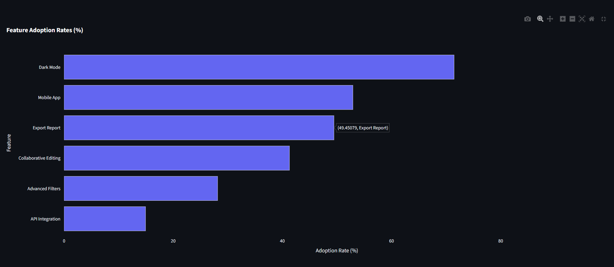
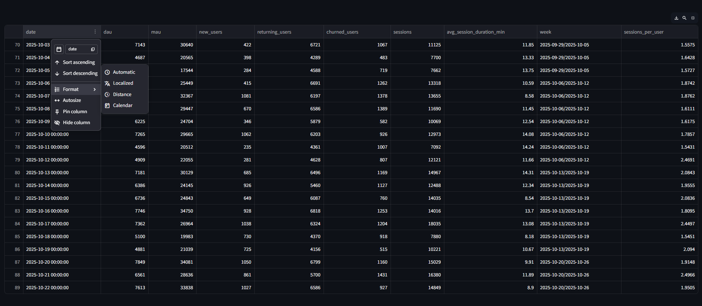

# 📊 ProductPulse - Interactive KPI Dashboard for Product Analytics


**ProductPulse** is a lightweight, interactive dashboard that helps Product Managers monitor key performance indicators (KPIs) and make data-driven decisions. Built with Python and Streamlit, it provides real-time insights into user engagement, retention, and product health.

---

## 🎯 Problem Statement

Product Managers need to track multiple KPIs daily, but:
- Spreadsheets are static and lack interactivity
- Enterprise analytics tools (Mixpanel, Amplitude) are expensive
- Custom dashboards require engineering resources

**Solution:** ProductPulse provides a self-contained, customizable dashboard that runs locally with zero cost.

---

## ✨ Features

- **📈 Real-Time Metrics:** DAU, MAU, Retention, Churn, NPS, Stickiness
- **📊 Interactive Charts:** Trend analysis, cohort retention, feature adoption
- **🎨 Clean UI:** Modern, responsive design with Plotly visualizations
- **📥 Data Export:** Download filtered data as CSV
- **🔧 Customizable:** Easy to adapt for your product's specific metrics
- **💰 Zero Cost:** Runs entirely locally, no API keys required

---

## 🚀 Quick Start

### Prerequisites
- Python 3.8 or higher
- pip package manager

### Installation

1. **Clone the repository:**
```bash
   git clone https://github.com/yourusername/productpulse.git
   cd productpulse
```

2. **Create virtual environment:**
```bash
   python -m venv venv
   source venv/bin/activate  # On Windows: venv\Scripts\activate
```

3. **Install dependencies:**
```bash
   pip install -r requirements.txt
```

4. **Generate synthetic data:**
```bash
   python data/generate_data.py
```

5. **Run the dashboard:**
```bash
   streamlit run app.py
```

6. **Open your browser:**
   Navigate to `http://localhost:8501`

---

## 📁 Project Structure
```
productpulse/
│
├── data/
│   ├── synthetic_users.csv          # User activity data
│   ├── synthetic_feedback.csv       # NPS feedback data
│   ├── synthetic_features.csv       # Feature adoption data
│   └── generate_data.py             # Data generation script
│
├── src/
│   ├── metrics.py                   # KPI calculation functions
│   ├── visualizations.py            # Plotly chart generators
│   └── utils.py                     # Helper utilities
│
├── app.py                           # Main Streamlit dashboard
├── requirements.txt                 # Python dependencies
├── README.md                        # This file
├── LICENSE                          # MIT License
└── architecture.txt                 # System architecture
```

---

## 📊 Key Metrics Tracked

| Metric | Description | Formula |
|--------|-------------|---------|
| **DAU** | Daily Active Users | Unique users per day |
| **MAU** | Monthly Active Users | Unique users per 30 days |
| **Retention Rate** | % of users who return | Returning / (Returning + Churned) × 100 |
| **Churn Rate** | % of users who leave | Churned / MAU × 100 |
| **NPS** | Net Promoter Score | (% Promoters - % Detractors) |
| **Stickiness** | Product engagement | (DAU / MAU) × 100 |
| **Feature Adoption** | % using specific features | Users Adopted / Total Users × 100 |

---

## 🎨 Dashboard Screenshots

### Main Dashboard


### Key Performance Indicators


### Trend Analysis


### NPS Distribution


### Feature Adoption


### Data Explorer


---

## 🔧 Customization

### Adding New Metrics

1. **Define calculation in `src/metrics.py`:**
```python
   def calculate_custom_metric(df):
       # Your logic here
       return result
```

2. **Add visualization in `src/visualizations.py`:**
```python
   def create_custom_chart(df):
       fig = go.Figure(...)
       return fig
```

3. **Display in `app.py`:**
```python
   metric_value = calculate_custom_metric(filtered_data)
   st.metric("Custom Metric", metric_value)
```

### Using Real Data

Replace synthetic CSVs with your own data. Ensure columns match:

**users.csv format:**
```csv
date,dau,mau,new_users,returning_users,churned_users,sessions,avg_session_duration_min
```

**feedback.csv format:**
```csv
date,user_id,nps_score,category
```

---

## 🛠️ Tech Stack

- **Python 3.8+** - Core language
- **Streamlit** - Web framework for dashboards
- **Pandas** - Data manipulation
- **Plotly** - Interactive visualizations
- **NumPy** - Numerical computations

---

## 📚 Learning Resources

- [Streamlit Documentation](https://docs.streamlit.io/)
- [Plotly Python](https://plotly.com/python/)
- [Product Metrics Guide](https://www.reforge.com/blog/product-metrics)

---

## 🤝 Contributing

Contributions are welcome! Please follow these steps:

1. Fork the repository
2. Create a feature branch (`git checkout -b feature/AmazingFeature`)
3. Commit changes (`git commit -m 'Add AmazingFeature'`)
4. Push to branch (`git push origin feature/AmazingFeature`)
5. Open a Pull Request

---

## 📄 License

This project is licensed under the MIT License - see the [LICENSE](LICENSE) file for details.

---

## 👤 Author

**Ayush Saxena**
- GitHub: [iamAyushSaxena](https://github.com/iamAyushSaxena)
- LinkedIn: [Ayush Saxena](https://www.linkedin.com/in/ayush-saxena-39a300225/)
- Email: aysaxena8880@gmail.com

---

## 🙏 Acknowledgments

- Inspired by real-world product analytics tools
- Built as a learning project for aspiring Product Managers
- Data generation techniques from industry best practices

---

## 📈 Future Enhancements

- [ ] User segmentation analysis
- [ ] A/B test result visualization
- [ ] Predictive churn modeling
- [ ] Email report automation
- [ ] Database integration (PostgreSQL/MySQL)
- [ ] Authentication & multi-user support

---


⭐ **If you find this project helpful, please consider giving it a star!**


